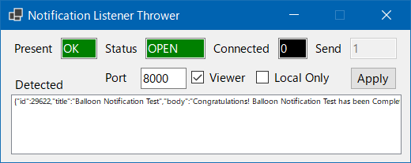
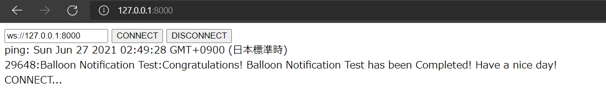

# NotificationListenerThrower
Get Windows 10 notifications and deliver via WebSocket.  
Windows 10 の通知を取得し、WebSocketで配信します。  

Turn on Viewer and apply, the simple WebSocket client will work in your browser.  
ViewerをオンにしてApplyすると、ブラウザにて簡易WebSocketクライアントが動作します。  
→ http://127.0.0.1:8000/

[Download](https://github.com/gpsnmeajp/NotificationListenerThrower/releases/)




## Specification
The settings are saved in setting.json in the same folder.  
設定は同フォルダのsetting.jsonに保存されます。

Notifications are taken every 100ms and new arrivals are delivered.  
通知は100ms秒間隔で取得し、新着が配信されます。  

The ping is delivered once a second.  
pingは1秒に1回配信されます。  

If Local Only is enabled, it will not accept connections from anyone other than localhost.  
Local Onlyが有効の場合、ローカルホスト以外からの接続は受け付けません  

If Present = NG, please allow the notification to be obtained from the Windows settings.  
Present=NGの場合、Windowsの設定から通知の取得を許可してください。  

Administrator privileges are used to open HTTP ports to the outside world. (Based on the HttpListener specification)  
管理者権限は、外部へHTTPポートを開くために使用します。(HttpListenerの仕様に基づく)  

```json
{"ping":true}

{"id":1, "title":"notification title","body":"notification body",}
```
## Trouble
Q. I can't access from another terminal. 別の端末からアクセスできない。  
A. Turn off Local Only and click Apply and allow your PC's firewall. Local OnlyをオフにしてApplyをクリック。、PCのファイアーウォールを許可してください。  

Q. 400 Bad Request (Local Only=on)  
A. Turn off Local Only and click Apply. Local OnlyをオフにしてApplyをクリック。  

Q. 400 Bad Request (Local Only=off)  
A. It is not a Websocket connection. Probably GET or POST? Websocket接続ではありません。おそらくGETやPOSTになっている？  

Q. 404 Not found  
A. Turn on Viewer and click Apply. ViewerをオンにしてApplyをクリック。  

Q. 503 Service Unavailable  
A. There are too many connections. Click Apply to disconnect. 続数が多すぎます。Applyをクリックで通信を切断します。  

## Reference
https://docs.microsoft.com/ja-JP/windows/apps/design/shell/tiles-and-notifications/notification-listener

## Licence
MIT Licence
